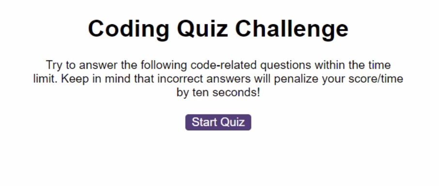

# code-quiz
A timed coding quiz with multiple-choice questions.

## Table of Contents

- [Full Description](#full-description)
- [Features](#features)
- [How to Use](#how-to-use)
- [Screenshots](#screenshots)
- [License](#license)

## Full Description

This coding quiz is a web application that lets users take a timed quiz that stores high scores. It allows users to compare thier progress to their peers.
URL of deployed app:  https://feliperyder.github.io/code-quiz/

## Features

- A start button that when clicked a timer starts and the first question appears.
 
- Questions contain buttons for each answer.

- When answer is clicked, the next question appears

- If the answer clicked was incorrect then subtract time from the clock

- The quiz ends when all questions are answered or the timer reaches 0.

- When the game ends, it displays users score and gives the user the ability to save their initials and their score.

## How to Use

1. Open URL of deployed app:  https://feliperyder.github.io/code-quiz/
2. Click the "Start Quiz" button.
3. Follow the prompts.
4. Enter initials to save your high score

## Screenshot

## License

MIT License
